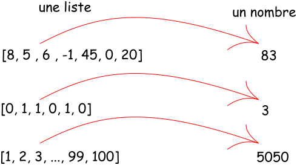
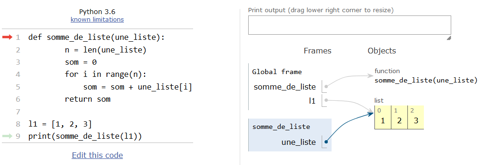

---
hide:
  - navigation
  - toc
  - footer
---

Il y a divers paradigmes de programmation. Dans les premières manipulations, on fait du code **impératif** qui consiste à donner des ordres à l'ordinateur qui les exécute alors...

Par exemple, le code suivant:

``` py 
    L = [8, 5 , 6 , -1, 45, 0, 20]
    som = 0
    for i in range(len(L)):
      som = som + L[i]
```
donne les instructions qui permettent de calculer la somme des éléments d'une liste ```L``` quelconque. 

Mais finalement ce code ne change pas si on change la liste ```L```: il aura toujours la vocation de calculer la somme des éléments de la liste proposée en préambule.... Des exemples:


<figure markdown>
  { width="200" }
  <figcaption> On visualise le côté transformation des fonctions mathématiques</figcaption>
</figure>

On a donc :

  - en **entrée** une liste Python
  - en **sortie** un nombre (entier ou décimal...)

L'idée qui nous intéresse est de reprendre le modèle mathématique des fonctions qui transforment une donnée en une autre. Un programme $f$ qui ferait ceci:

<center>
$f(Liste) = Somme$
</center>

La syntaxe Python qui crée **une fonction** est donnée par le code ci-contre:

``` py 
    def somme_de_liste(une_liste):
        n = len(une_liste)
        som = 0
        for i in range(n):
            som = som + une_liste[i]
        return som
```

Cette fonction ```Python```:

  - est une fonction ```Python``` car est déclarée avec la particule ```def```;
  - porte le nom **implicite** de ```somme_de_liste```( en snake case :fontawesome-regular-face-laugh-wink:
);
  - prend en **paramètre** la variable ```une_liste``` qui doit être bien entendu une liste!
  - **retourne** une valeur égale à la somme attendue.


!!! question " Comment on utilise cette fonction?"
    C'est simple! On exécute le script qui contient cette fonction: elle est alors ajoutée aux outils disponibles. On peut l'utiliser dans le script ou dans la console...
    ```py
    >>> l1 = [1, 2, 3]
    >>> somme_de_liste(l1)
    >>> 6 #1 + 2 + 3
    ```
Dans la console, l'appel de la fonction sur la liste ```l1```  retourne la valeur 6!
!!! warning "Toute votre attention"
    Il ne faut pas confondre le paramètre ```une_liste``` de la fonction qui est une **variable locale** à la fonction et la variable ```globale``` ```l1``` qui est une liste : lorsqu'on applique la fonction ```somme_de_liste``` à la liste ```l1```, le paramètre ```une_liste``` pointe alors vers l'objet ```l1``` et prend donc sa valeur! Le site Python Tutor permet de visualiser ce pointage.


<figure markdown>
  { width="800" }
  <figcaption> Visualisation sur Python Tutor</figcaption>
</figure>


La notion de variable **locale** ou **globale** n'est pas indispensable ici. Mais elle permet de comprendre certaines erreurs. Explorons le code (stupide...) suivant:
```py 
a = 3
def f(x):#stupide car on le nom de la fonction est trop générique...
    a = x**2
    return a
f(5)
print(a)
```

D'après vous que vaut la variable ```a``` après l'exécution de ce code?
??? tip " À savoir pour comprendre"
    Il y a deux variables ```a```: 

      - la première est déclarée en **dehors**  du corps de la fonction: elle est donc globale et vaut 3
      - la deuxième est déclarée **dans** la fonction: elle est locale et vaut le carré de la valeur prise par le paramètre ```x``` lors de l'appel de la fonction.
    L'affectation locale de ```a``` n'a pas d'effet sur la valeur globale ```a```. Après son exécution, ce code donne ```a=3```....

On dit que les variables n'ont pas la même portée... Dernier exemple rigolo avant de passer à autre chose...


!!! question " Anticipez ce que va faire ce programme."
    === "Code"

        ``` py
        def multiplie_par_2(nombre):
            i = 2
            return nombre * 2
        print(i)
        ```
    === "Réponse"
    
        La variable ```i``` est locale à la fonction et le programme principale n'a qu'une vision globale des variables et ne peut pas visualiser ```i``` dans le corps de la fonction : il ne peut donc pas savoir ce que vaut ```i``` et encore moins l'afficher. Python va donc lever une exception!

Lorsqu'on programme avec des fonctions Python, on utilise un **paradigme fonctionnel** mais le développement de cette notion est réservée aux experts...

!!! quote "Une fonction, c'est quoi alors?"
    Une fonction au sens informatique , est un ensemble d'instructions regroupées en un seul nom qui prend en entrée un ou plusieurs paramètres et qui retourne une valeur (ou autre chose...)

L'avantage d'utiliser des fonctions est la **factorisation** des programmes! On enchaîne les fonctions sur une entrée pour obtenir le résultat attendu. Un exemple!


!!! example "Extrait d'un cours de NSI"
    Supposons coder un message à la manière des soldats de Jules César (ancien Empereur romain assez connu). Le principe est assez simple: un décale de trois rangs dans l'alphabet latin les lettres. ```A``` devient alors ```D```, ```B``` devient ```C``` ,... puis ```X``` devient ```A```, ```Y``` devient ```B``` et enfin ```Z``` pour ```C```!
    Les fonctions ```python ``` suivante permettent ce codage:
    ```py
    def carac_en_nombre(carac):
          """ donne le code numérique du caractère carac
          de la table ASCII
          a:97,b:98,...
          """
          return ord(carac)

    def nombre_en_carac(nbre):
        """ donne le caractère correspondant au nombre nbre
          de la table ASCII
          97:a,98:b,...
          """
          return chr(nbre)

    def decalage(nbre, cle):
        """ ajoute la valeur de cle au nombre nbr
        on travaille modulo 26 pour que les sommes restent dans
        l'intervalle [0; 25]
        les translations de 97 permettent de travailler dans l'intervalle [0,25]
        """
        return (nbre + cle - 97)%26 + 97
    
    def codage_cesar(texte_origine):
        texte_final = ''#chaine de caractere vide
        for elt in texte_origine: #on parcourt le message elt par elt
            texte_final = texte_final + nombre_en_carac(decalage(carac_en_nombre(elt), 3))
        return texte_final
    message = "vous ne trouverez jamais la solution"
    MESSAGE = codage_cesar(message)
    ```
        


Quelques exercices à faire sans modération!


!!! note  "À faire :fontawesome-solid-laptop:"
      1. Recopier les fonctions suivantes:
      ```py
      a = 10
      b = -6
      def somme(x, y):
          return x + y
      def prod(x, y):
          return x * y
      def puissance(x, n):
          return x**n
      ```
      2. Avec ces fonctions, calculer:

          - le produit de a par b
          - la somme de a et 3
          - le produit de 15 par 148
          - $16^5$
          - le produit de la somme de a et b avec a
          - la puissance 4 de la somme du produit de b par 3 avec a.

!!! note  "À faire :fontawesome-solid-laptop:"
      On considère la fonction  ```mystere``` suivante:
      ```py
      from random import randint
      def mystere(nbre):
          L = []
          for i in range(nbre)
              L.append(randint(0, 6))
          return L
      ```

      1. Que fait cette fonction?
      2. Testez-là.
      3. Modifiez cette fonction pour que les nombres obtenus soient compris entre 0 et 20.
      4. Modifiez cette fonction pour que les nombres aléatoires soient compris entre 0 et ```N```, où ```N``` est passé en paramètre de la fonction.
      5. Créer une fonction ```moyenne_liste``` qui prend en paramètre une liste ```L``` et renvoie la moyenne des éléments de ```L```.
      6. Que donnera alors l'instruction ```moyenne_liste(mystere(10))```? et l'instruction ```mystere(moyenne_liste([1, 10]))```?

      


!!! note  "À faire :fontawesome-solid-laptop:"
      1. Écrire une fonction ```extreme``` qui prend en paramètre une liste et qui retourne la somme du premier et dernier élément de la liste
      2. Écrire une fonction ```deplace``` qui prend en paramètres une liste et un entier ```n``` plus petit que la longueur de la liste: cette fonction échange le premier élément de la liste avec celui situé au rang ```n```.