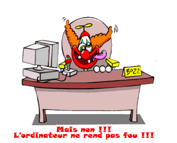

---
hide:
  
  - toc
---

Disons-le! Faire du python c'est un métier!!!

Comme une langue étrangère, c'est en pratiquant qu'on augmente ces compétences et souvent cela passe par de grosses prises de têtes!

<figure markdown>
  { width="500" }
  <figcaption></figcaption>
</figure>

Alors soyez patients et indulgents!