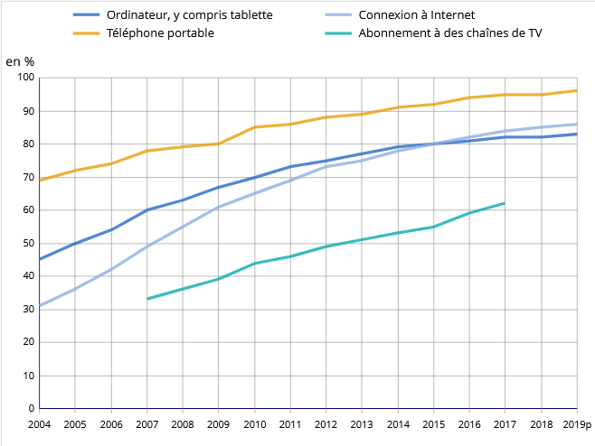
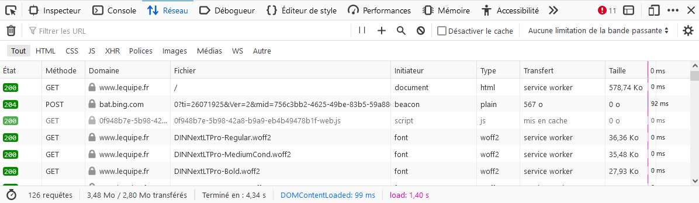
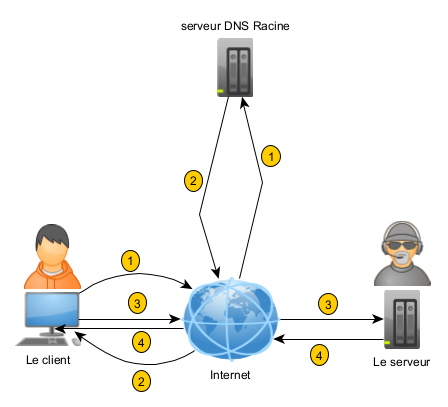

---
hide:
  - navigation
  - toc
  - footer
---


# Travail sur les réseaux informatiques

Notre monde est hyper-connecté! 

Connecté par des interfaces simples(web /appli.) mais surtout connecté au sens physique du terme. Dans une architecture classique de réseau, un ordinateur(le client) est relié par un câble, une fibre, une onde électromagnétique,... à un autre ordinateur(le serveur) qui lui fournit des services (pages web, messagerie, base de données,...) quasiment en continu. 

!!! caution "Objectifs"
    Ce cours précise sans trop de détails, le vocabulaire usuel des réseaux et les principes généraux de leur fonctionnement. Le travail se terminera par la simulation d'un réseau informatique et l'utilisation de bibliothèques ```Python``` pour communiquer entre deux ordinateurs d'une même salle.


# D'abord , un réseau physique...
Avant tout, pour que deux ordinateurs puissent communiquer entre eux, il faut qu'ils soient reliés l'un à l'autre . 

!!! info "Ce **lien physique** est essentiellement:"

    * un fil (fils de cuivre, fibre optique,...)
    * une onde électromagnétique(wifi, bluetooth)

Chez vous, la **box** est physiquement reliée au réseau téléphonique (ou fibre) par un câble: le reste du réseau y est souvent connecté en WIFI...
Dans nos salles de NSI, les ordinateurs sont reliés grâce des câbles **RJ45** droits aux **prises réseaux** ,elles-mêmes reliées à **une baie de brassage**, puis à un **switch** et enfin au serveur de l'établissement...seul élément du réseau relié à internet!

À une autre échelle, des câbles sous-marins ont même été déposés au fond des océans pour relier les continents européens et américains:
<center>
.
</center>

## Le réseau internet
Il y a de nombreuses confusions: les gens emploient indifféremment les mots **WEB** et **Internet** alors qu'ils ne désignent pas la même chose.

**Internet**, c'est un immense regroupement de différents réseaux qui ont en commun des protocoles de communication: c'est donc un réseau **physique**, **matériel**.

!!! info "Un élève de NSI ne doit pas faire cette confusion!"
    Le **WEB** est un service proposé sur ce réseau comme la messagerie ou le streaming: c'est une couche logicielle, immatérielle!

## Historique

À la fin des années 1950, en pleine guerre froide,  le **DoD**(Departement Of Defense (US)) souhaitait disposer d'un réseau de communication capable de résister à une attaque nucléaire. Le réseau téléphonique, vulnérable ne suffirait pas. En 1957, alors que les russes lancaient le premier satellite **spoutnik**, les Américains créent une section de recherche militaire appelée **ARPA**. Elle donna naissance en 1969 un réseau **Arpanet**, basé sur la commutation de paquets. Internet était né....

<center>


</center>

Cette toile ainsi tissée entre tous les serveurs, tous les routeurs, tous les ordinateurs, est physiquement le **réseau Internet**.


<center>


</center>

## Le réseau domostique de base!

Depuis 1990 et le début du WEB, les services rendus sur internet n'ont cessé d'évoluer. Les français se sont équipés en conséquences.

<center>


</center>


Le point névralgique de votre réseau est votre **box internet**:les principaux fournisseurs d'accès se disputent le marché(Orange, SFR, Free, Bouygues,...). Votre box a de super pouvoirs: 

- elle attribue une adresse IP à toutes les machines qui s'y connectent. C'est un **serveur DHCP!**
- elle assure la transition entre votre réseau privé (le vôtre avec vos ordinateurs, vos smartphones, l'imprimante, l'aspirateur, le frigo,...) et le réseau public, internet quoi... C'est une **passerelle!**
- elle achemine les paquets qu'elle reçoit de ses __hôtes__ (ceux précédemment cités...) à la destination souhaitée et transmet la réponse en retour. C'est un **routeur!**

D'autres services sont assurés par votre box comme le NAT, DNS ou le pare feu mais nous n'en dirons pas plus ici...

Vous pouvez même communiquer avec votre box __Orange__  de n'importe quel navigateur situé sur un ordinateur de votre réseau. Dans la barre d'adresse, saisissez **192.168.1.1** et la page d'administration apparaît(il faut tout de même saisir le mot de passe administrateur...):
<center>


</center>

## Le réseau du lycée

C'est un peu la même chose que chez vous mais en plus grand( sachez qu'il y a plus de mille ordinateurs dans le lycée!). Les réseaux sont classés selon leur extension (PAN, LAN, MAN, WAN) dans une hiérarchie bien définie.

<center>

</center>

# Un réseau logiciel

Internet est donc un réseau physique reliant finalement tous les ordinateurs entre eux. Mais comment se fait la communication? Comment les échanges d’informations se font-ils ? Pourquoi les informations ne se perdent pas dans ce réseau monstrueux? C’est une histoire de protocole...

!!! faq "Derrière le rideau..."
    Je souhaite consulter un site WEB. Pour cela, j'utilise un navigateur dans lequel je saisis l'URL du site dans la barre d'adresse et miracle, les informations me parviennent! Mais que s'est-il réellement passé????

Il s'agit bien d'une communication entre deux ordinateurs:

- celui qui effectue la **requête**: c'est le **client**!
- celui qui reçoit la requête: c'est le **serveur**! 

<center>

</center>

Toutes les procédures de connexion sont **transparentes** aux yeux de l'utilisateur. Mais sachez qu'elles existent et qu'elles sont exécutées à une allure vertigineuse, en principe.

!!! faq "Vous souhaitez observer ce qui se passe lorsque vous solliciter une site web comme _www.lequipe.fr_?"
     Facile, appuyer sur <kbd>F12</kbd> dans votre navigateur Firefox et visualisez dans l'onglet ```reseau``` les requêtes après validation de l'URL ci-dessus. 

<center>

</center>

Le client envoie une requête ```http```. On utilise ici la méthode ```GET``` pour obtenir une **ressource** du serveur distant: celle_ci est la racine (\) du site web. Vous pouvez consulter le contenu de la requête en cliquant sur la première ligne contenant le ```GET```...

Le serveur répond et fournit le code HTML de la première page. Vous remarquerez plusieurs requêtes(126 exactements) qui permettent de charger divers éléments (css, js, font,...)

Vous remarquerez la présence de la méthode ```POST``` qui permet de transmettre des données au serveur dans le corps de la requête (des cookies ou équivalent sans doute ici...).

!!! faq " Mais comment contacter le serveur qui héberge le site _www.lequipe.fr_?"
    Lorsque vous utilisez votre smartphone pour appeler votre copain, c'est la connaissance de son numéro qui rend possible la communication. Sur internet , le même principe est reconduit.

Le serveur a une **adresse IP publique**: par exemple l'adresse d'un des serveurs de ```google``` est ```216.58.214.163```. Vous ne me croyez pas! Tapez cette adresse dans la barre d'adresse d'un navigateur et vous verrez...

!!! faq "Mais suis-je obligez de connaître les adresses IP des millions de serveurs dans le monde?"
    Et bien ,NON! Il suffit juste de connaître son ```URL```, et encore... les moteurs de recherche nous envoient souvent vers le site recherché à partir d'un mot clé.

Un service dédié s'occupe alors d'associer à cette ```URL``` son adresse ```IP```, bien conservée quelque part en France dans un serveur Racine( en fait il y en a plusieurs...). C'est le protocole ```DNS```(Domain Name Service).

!!! TIP " J'ai compris!"
    Pour contacter un serveur web par exemple, il faut connaître son adresse ```IP``` qu'un serveur ```DNS``` me livre. Mais le problème reste posé: comment contacter le serveur racine d'un DNS???

Les routeurs auquels sont nécessairement reliés votre machine, ont en mémoire les adresses IP de ces serveurs (parfois même ils se trouvent dans le cache de votre navigateur...).

!!! Note "Les serveurs racines"
    Les serveurs racines ```DNS``` sont gérés par douze organisations différentes : deux sont européennes, une japonaise et les neuf autres sont américaines.

Le schéma suivant montre que si vous ne possédez pas dans votre machine l'adresse ```IP``` du site que vous souhaitez solliciter, une première requête est effectuée sur un serveur racine(1). Puis le serveur ```DNS``` vous répond en vous fournissant l'adresse du serveur web(2). Vous pouvez alors contacter ce serveur(3) qui en retour vous donne le code ```HTML```(4).

<center>

</center>

!!! TIP " J'ai compris!"
    Un serveur = une adresse ```IP```! Mais il y a des millions d'ordinateurs dans le monde. A t-on suffisamment d'adresse ```IP``` pour chacun?