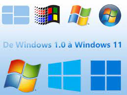
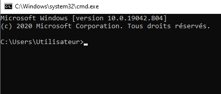
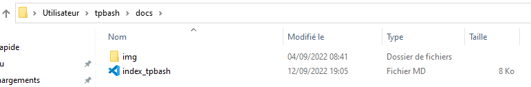
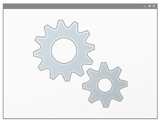

---
hide:
  - navigation
  - toc
  - footer
---

# Travail sur la ligne de commande

ou comment interagir avec le système d'exploitation sans utiliser son interface graphique!
<center>
{: .center}
</center>
## Une interface graphique qui a fait le succès de microsoft

Microsoft est l'entreprise qui a développé les premiers systèmes d'exploitation proposant une interface graphique au début des années 1990. Avant cette date, il fallait possèder des connaissances techniques pour exploiter les ressources d'un ordinateur. Les systèmes Windows (95, NT, XP, ...) ont démocratisé l'utilisation des machines au point où tout le monde pouvait maintenant s'en acheter une pour son utilisation personnelle: c'est le début de l'ère des PC(personal computer).

L'**interface graphique** proposée par les systèmes Windows est simple: il suffit de cliquer sur des **icônes** présentes sur le **bureau** pour lancer un programme!

En revanche, on ne peut pas faire ce qui n'a pas été prévu: des tâches d'administration par exemple...

## Passez la commande!

On peut commander le système d'exploitation en utilisant des **commandes** ou des **script**. Pour cela, il faut passer en ligne de commande....


!!! NOTE "À faire"
    1. Tapez <kbd>windows</kbd> + <kbd>R</kbd> puis `cmd` dans la fenêtre qui s'ouvre
    2. Vous devez obtenir quelque chose qui ressemble à ça: c'est **l'invite de commande** ou **le prompt**!
    <center>
    {: .center}
    </center>
    3. Tapez `dir` puis la touche <kbd>Entree</kbd>

!!!NOTE "À faire" 
    1. Tapez la commande `dir /?` dans le prompt. À quoi sert-elle?
    2. Affichez l'aide de la commande `copy`

## Arborescence des systèmes Windows

### Lecteurs

Sous Windows, les différentes partitions du disque dur sont identifiées par des lettres majuscules:

- historiquement, la partition `système` contenant le système d'exploitation est **C:**
- une bonne installation partitionne le disque dur en au moins deux lecteurs: un pour le **système** , l'autre pour les **données**. En cas de panne du système, on peut tout de même accèder aux données même si il faut formater la partition système.
- d'autres lecteurs( **E:,F:,..**) peuvent exister: lecteurs réseaux ou simplement une clé USB.

!!!NOTE "À faire" 
    1. Ouvrez l'explorateur de documents de votre ordinateur.
    2. Nommez les différents lecteurs que vous pouvez oberver


### Organisation des dossiers et des fichiers

Les partitions contiennent des **dossiers** (ou **répertoires**) et des **fichiers**. Les dossiers peuvent aussi contenir des dossiers appelés **sous-dossiers**, qui contiennent eux-mêmes des dossiers et/ou des fichiers...

Selon vos **droits** attribués lorsque vous vous identifiez( **loggez**), vous avez diverses autorisations sur ces fichiers ou dossiers:

- **droit de lecture**, vous pouvez lire **sans** modifier le contenu.
- **droit d'écriture**, vous pouvez lire et modifier le contenu.
- **aucun droit**, le dossier ou le fichier existe mais vous ne pouvez même pas le voir!

D'autres droits existent que nous ne développerons pas ici.

!!!NOTE "À faire" 
    Quels droits avez-vous sur les lecteurs de votre ordinateur?


### Chemin absolu et relatif

Pour désigner ou pointer vers une ressource(fichier ou dossier), on utilise son **chemin**. Il peut être:

- **absolu**: le chemin commence par la lettre de la partition et donne le nom de tous les dossiers qu'il faut travaerser pour arriver à la ressource. Par exemple, le chemin absolu de ce fichier est: `C:\Users\Utilisateur\tpbash\docs\index.md`
- **relatif**: le chemin identifie le chemin à partir du répertoire courant. Par exemple, les images de cette page sont stockées dans un dossier `data` et le chemin qui pointe vers l'image ci-dessous qui se nomme `chemin.png` est `\data\chemin.png`:
<center>
{: .center}
</center>

## Naviguer dans l'arborescence en ligne de commandes

### Des commandes de bases

- `dir ` affiche le contenu du répertoire courant. Pour connaître les options de cette commande , vous pouvez taper `dir /? ` pour afficher l'aide!
- `cd nom_du_dossier`(change directory) permet de se déplacer dans le dossier `nom_du_dossier` si il existe!
- `cd..` permet de remonter d'un niveau dans l'arborescence.
- `mkdir`(make directory) crée un nouveau dossier dans le répertoire courant!
- `copy` copie des fichiers ou des dossiers de la source vers la destination (tapez `copy /?` pour plus d'infos...)
- `del`(delete) efface le fichier passé en argument...

Le caractère * , appelé **joker**, remplace n'importe quel texte dans le nom d'un fichier. Par exemple, la commande:


```bash
copy *.txt C:\backup
```
copie **tous** les fichiers portant l'extension `.txt` dans le dossier `backup` situé à la **racine** du lecteur C.

!!!NOTE "À faire" 
    1. Ouvrez l'invite de commande.
    2. Dans le dossier `Mes documents`, créer un dossier `test` et un dossier `backup`.
    3. Allez ensuite dans ce dossier `test`.
    4. Tapez la commande `notepad coucou.txt`. Normalement, le bloc notes s'ouvre avec un avertissement. Confirmez votre volonté de créer ce fichier et mettez y le contenu de votre choix.
    5. Fermez `notepad` par la combinaison de touches <kbd>Alt</kbd>+<kbd>F4</kbd>
    6. Vérifier que le fichier `coucou.txt` existe bien dans le dossier test.
    5. En ligne de commande, avec les instructions ci-dessus, copier ce fichier dans le dossier `backup` et vérifier que la copie a fonctionné!

## Les variables d'environnement

Comment dans la manipulation précédente, l'exécutable de `notepad` a t-il pu être lancé? Son seul appel suffit-il ? Bizarre...

!!!NOTE "À faire" 
    En ligne de commande, tapez `firefox`. Que se passe t-il?

Les **variables d'environnement** sont des variables qui peuvent être appelées partout par tous les programmes. Elles stockent des informations considérées importantes commme:

- le nom de l'ordinateur, de l'utilisateur
- le chemin du répertoire `TEMP` contenant les fichiers temporaires
- la variable `PATH` contient le chemin d'exécutables(un programme en fait...) qui peuvent être appelés partout dans les programmes

!!!NOTE "À faire" 
    1. Ouvrez l'invite de commande.
    2. Tapez `PATH` et observez les chemins proposés
    3. Tapez `echo %USERNAME%`, pour afficher la valeur de la variable `USERNAME`

## Les fichiers de commande(.bat)

On souhaite souvent exécuter les mêmes tâches en ligne de commande. On peut alors regrouper les commandes dans un fichier qui sera directement lu par le système `DOS`: ce sont par exemple, les fichiers dont l'extension est `.bat`

!!!NOTE "À faire" 
    1. En ligne de commande tapez: 
    ```bash
    echo  Nous sommes le %date%, il est %time%
    ```
    2. Ouvrez le bloc notes en tapant la commande `notepad`( si elle est au `path`...) puis recopiez le texte `echo  Nous sommes le %date%, il est %time%`
    3. **Sauvegardez** le fichier sous le nom `dateheure` avec l'extension `.bat`. Vous devriez voir apparaître un engrenage dans l'icône décrivant le fichier: 
    <center>
    
    </center>
    4. Exécutez alors ce fichier par un double-clic. Que se passe t-il?
    5. Modifier le fichier en ajoutant une ligne avec l'instruction `pause`. Sauvegardez et exécutez à nouveau le fichier.