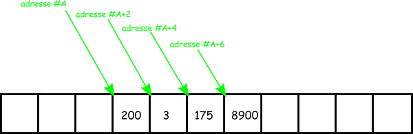
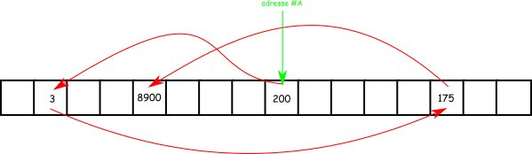
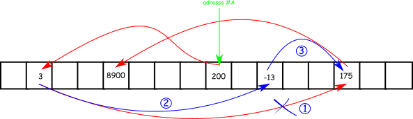

---
hide:
  - navigation
  - toc
  - footer
---

<center>
# Complexité des structures de données linéaires
</center>

<center>
## Définissons nos objets!
</center>
En informatique, les **listes** et les **tableaux** sont des _structures de données abstraites_ permettant de stocker de façon ordonnée des éléments.


!!! cite "Ce que dit Wikipédia sur les listes..."
    En informatique, une liste est une structure de données permettant de regrouper des données de manière à pouvoir y accéder librement (contrairement aux files et aux piles, dont l'accès se fait respectivement en mode FIFO et LIFO).

Le célèbre site donne aussi les premières **primitives** qui opérent sur cette structure: Insertion, Suppression, Prédicat(la liste est-elle vide?), Dénombrement,...


!!! cite "Ce que dit Wikipédia sur les tableaux..."
    En informatique, un tableau est une structure de données représentant une séquence finie d'éléments auxquels on peut accéder efficacement par leur position, ou indice, dans la séquence. C'est un type de conteneur que l'on retrouve dans un grand nombre de langages de programmation. 

Le langage Python crée une ambiguité dans les définitions de ces deux types. En effet, parmi les listes, on peut distinguer de manière générale de deux types:
<center>

 - les tableaux
 - les listes chaînées

</center>
Dans cette leçon, nous nous intéresserons à :
<center>

 - la manière dont ces structures sont stockées en mémoire
 - la complexité des opérations de bases(insertion, suppression, parcours,...) sur ces structures

</center>
Nous finirons par définir la notion déjà connue de **dictionnaire** avec de nouvelles considérations...

<center>
## Implémentation des tableaux en mémoire
</center>
Considérons le tableau de quatre éléments : ```200, 3, 175, 8900``` que nous souhaitons stocker en mémoire.
Contrairement au langage Python où la manipulation est aisée, la déclaration des tableaux dans le langage ```C``` est plus rigoureuse:

``` C
int tab[4] //declaration du tableau tab de 4 elements du même type int
```

Chaque entier est codé sur 16 bits(ou 32), soit 2 octets: il faut donc réserver en mémoire 4 cases de 2 octets pour stocker ce tableau. En supposant que la mémoire d'un ordinateur est un long, très long, ruban de cases alors l'**allocation** en mémoire du tableau peut s'illustrer ainsi:

<center>

</center>

Les cases vides modélisent des emplacements mémoires vides ou contenant d'autres données...
L'adresse du tableau est ```#A```(valeur hexadécimale sur deux octets) et c'est aussi celle de ```tab[0]```. Celle de ```tab[i]``` est alors ```#A+i*2```...

Donc comme le précise le site _openclassrooms_:

!!! cite "Implémentation en mémoire des tableaux statiques"
    - Lorsqu'un tableau est créé, il prend un espace contigu en mémoire : les cases sont les unes à la suite des autres.
    - Toutes les cases d'un tableau sont du même type. Ainsi, un tableau de ```int``` contiendra uniquement des ```int```  , et pas autre chose.

Naturellement, il est donc interdit de créer un tableau dont la taille dépend de la valeur d'une variable: c'est ce que nous appelons une **allocation dynamique**, et c'est un peu ce que fait ```Python``` dans la gestion transparente de ses listes!

<center>
## Avantages et inconvénients de cette structure
</center>

L'accès à un élément du tableau se fait en **temps constant** : en d'autres termes, si ```n``` est la taille du tableau, l'accès ne dépend pas de ```n```.

Pour l'insertion d'un nouveau élément dans le tableau, il faut **allouer** un nouvel espace mémoire qui passe par la recopie de tous les éléments du tableau auquel on ajoute le nouveau. Cette opération dépend de la taille ```n``` du tableau et son temps d'exécution lui est proportionnel !

!!! info "Complexité des opérations sur un tableau statique"
    L' accès à un élément d'un tableau statique est en ```O(1)``` et l'ajout est en ```O(n)```.


Et d'après vous? Quelle est la complexité de la suppression d'un élément?

<center>
## Implémentation des listes chaînées
</center>

L'élément de base pour la création d'une **liste chaînée** est le **maillon** constitué de:

- sa **valeur** en premier
- un **pointeur** en second, qui désigne l'adresse mémoire du suivant dans la structure (adresse éventuellement nulle pour désigner le dernier!)

<center>

</center>

La liste est ainsi chaînée par une succession de maillon chacun pointant vers le suivant, le dernier ayant un pointeur nul (```NULL```). Les valeurs de la liste ne sont plus stockées à des endroits contigus de la mémoire.


<center>
## Avantages et inconvénients de cette structure
</center>

Pour accéder à un élément quelconque de la liste, il n'y a pas de choix: il faut parcourir la liste à partir du premier. Ce parcours dépend évidemment de la taille ```n``` de la structure. La complexité de l'opération est proportionnelle à ```n```.

En revanche, l'insertion d'un élément est à opération constante. Le dessin ci-dessous montre les étapes d'insertion dans une liste chaînée:

<center>

</center>

L'algorithme lorsque qu'on souhaite insérer ```-13``` en deuxième position est:

1. On détruit le pointeur de la première.
2. On définit ce pointeur vers la valeur du maillon portant la valeur ```-13```.
3. On définit le pointeur du maillon inséré vers la valeur du suivant dans la chaîne.

Ces trois opérations sont indépendantes de la taille de la liste chaînée: l'insertion se fait **en temps constant**.

En résumé:
<center>

|Opérations| Tableau statique | Listes chaînées|
|-|-|-|
|Accés à un élément|```O(1)```|```O(n)```|
|Insertion ou suppression|```O(n)```|```O(1)```|

</center>

On pourrait évoquer la complexité d'autres opérations élémentaires comme l'ajout ou la suppression au début, à la fin,... ce que nous ferons en exercices.

Nous pourrions aussi évoquer la notion de listes **doublement** chaînées constituées de maillon qui pointe vers les maillons suivants et précédents. En revanche, si elles améliorent la complexité de certaines opérations, elles contiennent plus d'informations, donc plus de mémoire!

Enfin, même si le programme de NSI ne les évoque pas, les **tableaux dynamiques** sont des structures hybrides qui permettent de conserver la complexité en temps constant des tableaux statiques et de permettre l'insertion aussi en temps constant.

Nous n'en dirons pas plus sur le sujet...


<center>
# Les dictionnaires
</center>

!!! info "Une définition"
    Un dictionnaire est un ensemble de clés/valeurs(```C/V```) dont les composantes sont appelées via un **descripteur** (la clé!) et non pas un indice.


Depuis la classe de première, nous connaissons les opérations de bases permises sur un dictionnaire et leur syntaxe en ```python```:


<center>

|Opérations| Code python|
|-|-|
|Créer un dictionnaire vide|``` d = []```|
|Ajouter une association ```c,v```|```d["Maths"] = 18 ```|
|Lire la valeur ```v``` d'une clé ```c```|```d["Maths"] ```|

</center>

Mais par exemple, il n'existe pas de **primitive** simple qui retourne la clé d'une valeur!
L'implémentation du type dictionnaire doit permettre de réaliser ces trois opérations de base en temps d'exécution efficace. On cherche idéalement une complexité en ```O(1)``` pour la recherche, l'insertion ou la suppression. Comment faire?
!!! info "Le hachage"
    Python a choisi les  **tables de hachages** pour cette implémentation.

Pour comprendre, il faut d'abord définir une **fonction de hachage**:

!!! cite "Ce que dit Wikipédia ..."
    On nomme fonction de hachage, de l'anglais hash function (hash : pagaille, désordre, recouper et mélanger) par analogie avec la cuisine, une fonction particulière qui, à partir d'une donnée fournie en entrée, calcule une **empreinte numérique** servant à identifier rapidement la donnée initiale, au même titre qu'une signature pour identifier une personne.

Je reprends aussi les termes pertinents de l'encyclopédie :

!!! info "Rôle d'une fonction de haschage"
    On peut voir une fonction de hachage comme un moyen de replier l'espace de données que l'on suppose potentiellement très grand et très peu rempli pour le faire entrer dans la mémoire de l'ordinateur.

Le principe est d'utiliser les empreintes des clés comme indices des éléments de la table. Ces empreintes sont des nombres entiers obtenus en hachant la clé des objets à stocker, souvent une chaîne de caractères. On peut ensuite retrouver l'objet associé à une clé donnée : il suffit de hacher la clé pour obtenir une empreinte et de lire dans le tableau l'élément dont l'indice est cette empreinte.Au final, la complexité d’une insertion et d’une lecture dans une table de hachage sera « en
moyenne » en ```O(1)```.

!!! info "Les algorithme de hachage et les mots de passe"
    Les mots de passe ne sont pas stockés en clair: c'est leur empreinte obtenu par un algorithme de hachage (```SHA-256``` par exemple) qui est utilisé. Cet algorithme produit un **condensat** de 256 bits.


Mais, il faut être certain que la fonction de hachage choisit remplit bien son rôle: à chaque entrée, elle doit associer une empreinte numérique **unique**. On parle de **collision** si deux entrées différentes ont une empreinte numérique égale (en maths, on dirait que la fonction n'est pas injective...). La fonction de hachage du ```SHA-256``` a remplacé celle du ```MD5``` qui créait beaucoup de collision.

