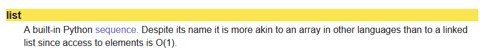

---
hide:
  - navigation
  - toc
  - footer
---


# Interface et implémentation

## Principe

!!! tldr "Une structure de données ?"
    Une structure de données est une collection, une organisation de données en vue de leur utilisation: les listes, les tuples ou les dictionnaires ```Python ``` sont des exemples de structures.

Dès que la structure est déclarée, il est nécessaire alors de définir les **méthodes** qui agissent sur ces objets : c'est **l'interface**  qui permet entre autres, de créer la structure, de la modifier, d'afficher son  contenu voire de la supprimer...

!!! example " L'interface des listes Python"
    En fouillant un peu dans la documentation [ici](https://devdocs.io/python~3.10/), il semblerait que les listes ```Python ``` soit des tableaux (array). L'interface des listes est celle des séquences : par exemple, la méthode ```len ``` s'applique non seulement aux listes mais aussi aux tuples et aux chaînes de caractères...




Donc, si il existe des méthodes qui agissent sur les structures de données, on ne sait pas nécessairement comment elles sont codées. La méthode ```reverse ``` des listes est simple à comprendre: elle renverse les indices de la liste! Mais de quelle façon?

 Mieux, la méthode ```sort ``` trie les listes: mais quel algorithme est utilisé pour cela?

!!! tldr "Une interface"
    Un ensemble d'informations qui permet de décrire une structure de données ainsi que les méthodes qui agissent sur ces données

!!! note "À faire"
    Les bibliothèques Python ont subi une attaque informatique et la méthode ```reverse ``` des listes a été définitivement perdue. Écrire une fonction ```revers_new``` qui pour une liste donnée retourne la liste dans l'autre sens...

La façon dont sont codées les méthodes présentées dans les interfaces, sont a priori invisible aux yeux de l'utilisateur: on parle d'**implémentation** d'une méthode lorsqu'on découvre comment est programmée la méthode. Pour une même méthode, il peut exister alors plusieurs implémentations...

!!! tldr "En résumé..."
    L'**interface** est la partie visible pour qui veut utiliser ce type de données. Elle précise comment utiliser la structure de données sans se préoccuper de la façon dont les choses ont été programmées, c'est-à-dire **son implémentation**.


##API...birth day!

Une autre interface bien utile, une API!

!!! tdlr "C'est quoi une API?"
    Une API (Application Programming Interface), ou interface de programmation, est un
    ensemble normalisé de briques logicielles grâce auxquelles un système informatique
    offre des services à d’autres systèmes. Quand nous consultons la météo sur notre
    smartphone, il utilise l’API du service météo en question. La plupart des applications
    mobiles sont conçues autour d’une ou plusieurs API.

L’objectif d’une API est de fournir des fonctionnalités, sans révéler le fonctionnement
interne de l’application qui fournit les données. C’est en cela qu’on dit qu’une API est
en façade : on ne voit pas l’intérieur du bâtiment

!!! example "Un exemple d'API météo"
    Le site [ici](https://openweathermap.org/api) de openweather offre une api pour des informations sur la météo de votre ville.
    Pour pouvoir l'utiliser il faut utiliser un jeton (Token) fourni lors de l'inscription. Bien que le service soit gratuit, il existe de nombreuses options payantes.


!!! note "À faire"
    Effectuer la requete ci-dessous dans un script python.

    1. Quelle est la nature de la variable ```data```? 
    2. Modifiez le code pour obtenir la vitesse du vent et sa direction.


``` python
import requests
 
url="http://api.openweathermap.org/data/2.5/weather?q=agen&appid=4370f9449a4ab35020f78dffcc0fe303"
content = requests.get(url)
data = content.json()
t = data['main']['temp']
print("La témpérature est de {} degrés C".format(t-273.15))

```

On peut aussi effectuer des requêtes en Javascript et modifier ainsi le contenu d'une page web. Ci-dessous, une fonction utilisant une API donnant la position de la station spatiale ISS utilisant des promesses...

``` javascript
function marequete() {
    fetch("http://api.open-notify.org/iss-now.json")
        .then(res => res.json())
        .then(
            function isspos(jsonobj){
                
                var lat = jsonobj['iss_position']['latitude'];
                var lon = jsonobj['iss_position']['longitude'];
                document.getElementById("latitude").innerText =  lat;
                document.getElementById("longitude").innerText =  lon;
            }
        )
}

```
Concrètement, une API est constituée d’une bibliothèque logicielle, d’un service
web et d’une description qui spécifie comment les clients peuvent interagir avec la
plateforme logicielle qui fournit les données, appelée aussi **fournisseur**.


## Un peu de manipulation

!!! note "À faire"
    Comment utiliser une API dans une page WEB?

    1. Récupérer la page d'accueil du site [ici](../fichier/index.html)
    2. Explorez le code de la page.


De nombreuses API disposent d’un **wrapper** Python : c’est un module Python qui
permet d’interroger la base de données du fournisseur de façon simplifiée, sans avoir
à écrire les requêtes Web, ni à interpréter les réponses. Celles-ci sont généralement
écrites au format JSON, qui est un format d’échange de données, au même titre
que le XML. À partir de ces réponses, le wrapper Python génère des listes ou des
dictionnaires, facilement manipulables.


!!! note "À faire"
    On va utiliser l'API Mars Rover Photos disponible à cette [adresse](https://api.nasa.gov/) .

    1. Générer une clé d'authentification (il existe une clé de démo DEMO_KEY mais qui donne un accès limité...)
    2. Installer le wrapper Python ```nasaapi```(comme un simple module...) ou ```python-nasa-api``` documenté [ici](https://pypi.org/project/python-nasa-api/)
    3. Cherchez comment obtenir l'URL de la première photo que le rover Curiosity a prise le 50ième jour martien, avec sa caméra arrière nommée __Rear Hazard Avoidance Camera__ ou simplement __RHAZ__. 
    4. Copier /collez cette URL dans un navigateur WEB pour visualiser cette photo.
    5. À l'aide des données reçues du rover Curioity, donnez:

        - Id de curiosity
        - Sa date de lancement
        - Sa date d'atterissage sur Mars
    
    6. Utiliser le module ```webbrowser``` pour afficher directement les photos trouvées.


``` python
# importation du module webbrowser
import webbrowser
# importation du sous-module MarsRovers du module nasaapi
from nasaapi import MarsRovers
# initialisation de la connexion avec l’API et création de l’ob-jet rovers
rovers = MarsRovers(« coller ici la clé API NASA »,« ici le jour» , « NAV-CAM »)
# récupération des données de Curiosity (dictionnaire)
cur = rovers.curiosity()
print(cur)
# accès à l’URL de la quatrième photo
url_photo = « compléter ici»
# envoi de l’URL dans le navigateur
webbrowser.open_new_tab(url_photo)

```


