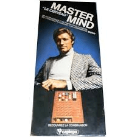
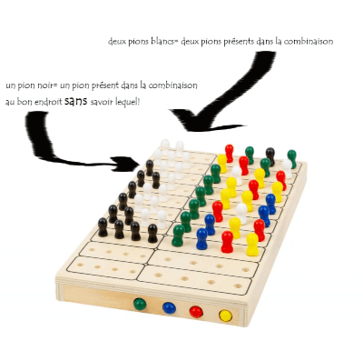

---
hide:
  - navigation
  - toc
  - footer
---

<h1 style = "color:white; font-size:400%;text-align:center; background-image:url(img/mn.jpg);">Mon projet sur le mastermind</h1>

<h2 style = "color:Tomato; font-size:300%;text-align:center; background:linear-gradient(to right,#ffbe02a1 0px,#fd606aba 100%);">Introduction</h2>
Le mastermind est un jeu de société fort connu notamment des plus anciens...(et oui ! il fallait s'occuper...) 

Le principe est simple: un joueur1 choisit une combinaison de quatre couleurs qu'il garde secret et son camarade, le joueur2,  a 10 coups pour la retrouver. À chaque proposition, le joueur1 indique au joueur 2 le nombre de:

- boules présentes dans sa combinaison (par la présence de petits pions blancs)
- boules placées au bont endroit sans indiquer lesquelles!(par la présence de petits pions noirs)

On se propose de fabriquer une émulation du jeu afin de pouvoir jouer avec un ordinateur.

<h2 style = "color:Tomato; font-size:300%;text-align:center; background:linear-gradient(to right,#ffbe02a1 0px,#fd606aba 100%);">Programmation du jeu</h2>

## Poser des conditions:

On va faire en sorte pour simplifier que le joueur1 doit proposer une combinaison de couleurs différentes: le joueur2 pourra néamoins proposer n'importe quelle proposition...
En revanche, il ne pourra proposer que 10 coups!

## Jouer en console: